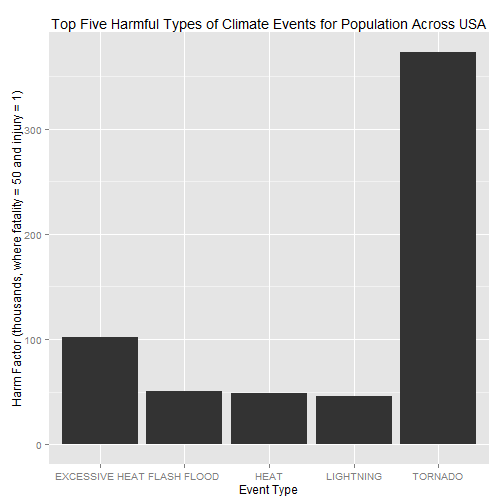
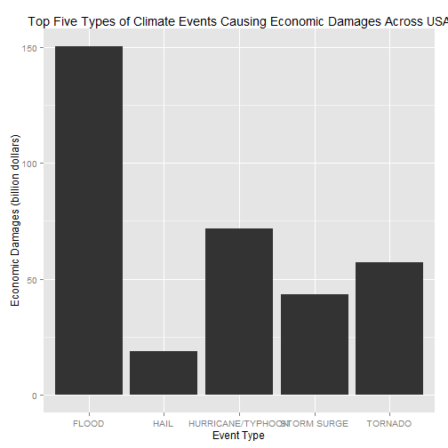

##The worst climate events in the United States  


###Synopsis

This study explores the U.S. National Oceanic and Atmospheric Administration's (NOAA) storm database. This database tracks characteristics of major storms and weather events in the United States, including when and where they occur, as well as estimates of any fatalities, injuries, and property damage.  

We will separate the analysis into two main lines: people and properties.  

For people, we will tabulate **fatalities** and **injuries** against event type.  For tabulation purposes, we assume that one fatality equals 50 injuries.  

For properties, we will tabulate damages in **properties** and **crops** against event type.  

In the future, if we need to bind the two lines, it will be necessary to specify values to *fatality* and *injury* because the properties line is already monetized.  

###Data Processing  

The data for this assignment come in the form of a comma-separated-value file compressed via the bzip2 algorithm to reduce its size. You can download the file from the course web site:  

https://d396qusza40orc.cloudfront.net/repdata%2Fdata%2FStormData.csv.bz2 [47Mb]  

There is also some documentation of the database available. Here you will find how some of the variables are constructed/defined:  

- National Weather Service Storm Data Documentation, at https://d396qusza40orc.cloudfront.net/repdata%2Fpeer2_doc%2Fpd01016005curr.pdf and  

- National Climatic Data Center Storm Events FAQ.  

The events in the database start in the year 1950 and end in November 2011. In the earlier years of the database there are generally fewer events recorded, most likely due to a lack of good records. More recent years should be considered more complete.  


```r
stormdata <- read.csv("./data/repdata-data-StormData.csv.bz2")
str(stormdata)
```

```
## 'data.frame':	902297 obs. of  37 variables:
##  $ STATE__   : num  1 1 1 1 1 1 1 1 1 1 ...
##  $ BGN_DATE  : Factor w/ 16335 levels "1/1/1966 0:00:00",..: 6523 6523 4242 11116 2224 2224 2260 383 3980 3980 ...
##  $ BGN_TIME  : Factor w/ 3608 levels "00:00:00 AM",..: 272 287 2705 1683 2584 3186 242 1683 3186 3186 ...
##  $ TIME_ZONE : Factor w/ 22 levels "ADT","AKS","AST",..: 7 7 7 7 7 7 7 7 7 7 ...
##  $ COUNTY    : num  97 3 57 89 43 77 9 123 125 57 ...
##  $ COUNTYNAME: Factor w/ 29601 levels "","5NM E OF MACKINAC BRIDGE TO PRESQUE ISLE LT MI",..: 13513 1873 4598 10592 4372 10094 1973 23873 24418 4598 ...
##  $ STATE     : Factor w/ 72 levels "AK","AL","AM",..: 2 2 2 2 2 2 2 2 2 2 ...
##  $ EVTYPE    : Factor w/ 985 levels "   HIGH SURF ADVISORY",..: 834 834 834 834 834 834 834 834 834 834 ...
##  $ BGN_RANGE : num  0 0 0 0 0 0 0 0 0 0 ...
##  $ BGN_AZI   : Factor w/ 35 levels "","  N"," NW",..: 1 1 1 1 1 1 1 1 1 1 ...
##  $ BGN_LOCATI: Factor w/ 54429 levels "","- 1 N Albion",..: 1 1 1 1 1 1 1 1 1 1 ...
##  $ END_DATE  : Factor w/ 6663 levels "","1/1/1993 0:00:00",..: 1 1 1 1 1 1 1 1 1 1 ...
##  $ END_TIME  : Factor w/ 3647 levels ""," 0900CST",..: 1 1 1 1 1 1 1 1 1 1 ...
##  $ COUNTY_END: num  0 0 0 0 0 0 0 0 0 0 ...
##  $ COUNTYENDN: logi  NA NA NA NA NA NA ...
##  $ END_RANGE : num  0 0 0 0 0 0 0 0 0 0 ...
##  $ END_AZI   : Factor w/ 24 levels "","E","ENE","ESE",..: 1 1 1 1 1 1 1 1 1 1 ...
##  $ END_LOCATI: Factor w/ 34506 levels "","- .5 NNW",..: 1 1 1 1 1 1 1 1 1 1 ...
##  $ LENGTH    : num  14 2 0.1 0 0 1.5 1.5 0 3.3 2.3 ...
##  $ WIDTH     : num  100 150 123 100 150 177 33 33 100 100 ...
##  $ F         : int  3 2 2 2 2 2 2 1 3 3 ...
##  $ MAG       : num  0 0 0 0 0 0 0 0 0 0 ...
##  $ FATALITIES: num  0 0 0 0 0 0 0 0 1 0 ...
##  $ INJURIES  : num  15 0 2 2 2 6 1 0 14 0 ...
##  $ PROPDMG   : num  25 2.5 25 2.5 2.5 2.5 2.5 2.5 25 25 ...
##  $ PROPDMGEXP: Factor w/ 19 levels "","-","?","+",..: 17 17 17 17 17 17 17 17 17 17 ...
##  $ CROPDMG   : num  0 0 0 0 0 0 0 0 0 0 ...
##  $ CROPDMGEXP: Factor w/ 9 levels "","?","0","2",..: 1 1 1 1 1 1 1 1 1 1 ...
##  $ WFO       : Factor w/ 542 levels ""," CI","$AC",..: 1 1 1 1 1 1 1 1 1 1 ...
##  $ STATEOFFIC: Factor w/ 250 levels "","ALABAMA, Central",..: 1 1 1 1 1 1 1 1 1 1 ...
##  $ ZONENAMES : Factor w/ 25112 levels "","                                                                                                                               "| __truncated__,..: 1 1 1 1 1 1 1 1 1 1 ...
##  $ LATITUDE  : num  3040 3042 3340 3458 3412 ...
##  $ LONGITUDE : num  8812 8755 8742 8626 8642 ...
##  $ LATITUDE_E: num  3051 0 0 0 0 ...
##  $ LONGITUDE_: num  8806 0 0 0 0 ...
##  $ REMARKS   : Factor w/ 436781 levels "","-2 at Deer Park\n",..: 1 1 1 1 1 1 1 1 1 1 ...
##  $ REFNUM    : num  1 2 3 4 5 6 7 8 9 10 ...
```

The first line: **population**.  
No monetary values, but two unbalanced variables: *fatalities* and *injuries*.  
Then we determine that one fatality equals fifty injuries and made the calculations.  


```r
library(data.table)
library(reshape2)
peopledata <- data.table(evtype=stormdata$EVTYPE, fatalities=stormdata$FATALITIES, 
                         injuries=stormdata$INJURIES)
summary(peopledata)
```

```
##                evtype         fatalities     injuries     
##  HAIL             :288661   Min.   :  0   Min.   :   0.0  
##  TSTM WIND        :219940   1st Qu.:  0   1st Qu.:   0.0  
##  THUNDERSTORM WIND: 82563   Median :  0   Median :   0.0  
##  TORNADO          : 60652   Mean   :  0   Mean   :   0.2  
##  FLASH FLOOD      : 54277   3rd Qu.:  0   3rd Qu.:   0.0  
##  FLOOD            : 25326   Max.   :583   Max.   :1700.0  
##  (Other)          :170878
```

```r
melted_peopledata <- melt(peopledata, id=c("evtype"))
tidy_peopledata <- dcast(melted_peopledata, formula = evtype ~ variable, sum)
tidy_peopledata$harmfac <- 50 * tidy_peopledata$fatalities + tidy_peopledata$injuries
top20_people <- head(order(tidy_peopledata$harmfac, decreasing=TRUE), n=20)
plot_peopledata <- tidy_peopledata[top20_people,]
plot_peopledata
```

```
##                      evtype fatalities injuries harmfac
## 834                 TORNADO       5633    91346  372996
## 130          EXCESSIVE HEAT       1903     6525  101675
## 153             FLASH FLOOD        978     1777   50677
## 275                    HEAT        937     2100   48950
## 464               LIGHTNING        816     5230   46030
## 856               TSTM WIND        504     6957   32157
## 170                   FLOOD        470     6789   30289
## 585             RIP CURRENT        368      232   18632
## 359               HIGH WIND        248     1137   13537
## 972            WINTER STORM        206     1321   11621
## 19                AVALANCHE        224      170   11370
## 586            RIP CURRENTS        204      297   10497
## 278               HEAT WAVE        172      309    8909
## 140            EXTREME COLD        160      231    8231
## 760       THUNDERSTORM WIND        133     1488    8138
## 310              HEAVY SNOW        127     1021    7371
## 427               ICE STORM         89     1975    6425
## 141 EXTREME COLD/WIND CHILL        125       24    6274
## 30                 BLIZZARD        101      805    5855
## 676             STRONG WIND        103      280    5430
```

The second line: **properties**.  
Monetary values: *properties* and *crops*.  
There is one kind of separation of mantissa and exponent, and the codification of the exponents is sometimes weird. As "B" are billions, "M" or "m" are millions, and "K" are thousands, we normalized these values befores plotting. Some values were missed, but do not impact the results, only billions matters.   


```r
library(data.table)
library(reshape2)
monpropdmg <- stormdata$PROPDMG * 
    ifelse(stormdata$PROPDMGEXP=="B", 1,
           ifelse(stormdata$PROPDMGEXP%in%c("M","m"), 1E-3, 1E-6))
moncropdmg <- stormdata$CROPDMG * 
    ifelse(stormdata$CROPDMGEXP=="B", 1,
           ifelse(stormdata$CROPDMGEXP%in%c("M","m"), 1E-3, 1E-6))
prcropdata <- data.table(evtype=stormdata$EVTYPE, propdmg=monpropdmg, cropdmg=moncropdmg)
summary(prcropdata)
```

```
##                evtype          propdmg       cropdmg 
##  HAIL             :288661   Min.   :  0   Min.   :0  
##  TSTM WIND        :219940   1st Qu.:  0   1st Qu.:0  
##  THUNDERSTORM WIND: 82563   Median :  0   Median :0  
##  TORNADO          : 60652   Mean   :  0   Mean   :0  
##  FLASH FLOOD      : 54277   3rd Qu.:  0   3rd Qu.:0  
##  FLOOD            : 25326   Max.   :115   Max.   :5  
##  (Other)          :170878
```

```r
melted_prcropdata <- melt(prcropdata, id=c("evtype"))
tidy_prcropdata <- dcast(melted_prcropdata, formula = evtype ~ variable, sum)
tidy_prcropdata$damgfac <- tidy_prcropdata$propdmg + tidy_prcropdata$cropdmg
top20_prcrop <- head(order(tidy_prcropdata$damgfac, decreasing=TRUE), n=20)
plot_prcropdata <- tidy_prcropdata[top20_prcrop,]
plot_prcropdata
```

```
##                        evtype propdmg   cropdmg damgfac
## 170                     FLOOD 144.658  5.661968 150.320
## 411         HURRICANE/TYPHOON  69.306  2.607873  71.914
## 834                   TORNADO  56.937  0.415113  57.353
## 670               STORM SURGE  43.324  0.000005  43.324
## 244                      HAIL  15.733  3.025977  18.759
## 153               FLASH FLOOD  16.141  1.421317  17.563
## 95                    DROUGHT   1.046 13.972566  15.019
## 402                 HURRICANE  11.868  2.741910  14.610
## 590               RIVER FLOOD   5.119  5.029459  10.148
## 427                 ICE STORM   3.945  5.022113   8.967
## 848            TROPICAL STORM   7.704  0.678346   8.382
## 972              WINTER STORM   6.688  0.026944   6.715
## 359                 HIGH WIND   5.270  0.638571   5.909
## 957                  WILDFIRE   4.765  0.295473   5.061
## 856                 TSTM WIND   4.485  0.554007   5.039
## 671          STORM SURGE/TIDE   4.641  0.000850   4.642
## 760         THUNDERSTORM WIND   3.483  0.414843   3.898
## 409            HURRICANE OPAL   3.173  0.019000   3.192
## 955          WILD/FOREST FIRE   3.002  0.106797   3.109
## 298 HEAVY RAIN/SEVERE WEATHER   2.500  0.000000   2.500
```

*Note: There is another problem not addressed in this study: the `EVTYPE` values are not normalized, so we have lots of types* **flood** *something, and* **wind**, *and* **rain**, *etc. Shrink the 985 types into 10 or 20 normalized types is a hard work and far from beyond the scope of this assignment.*   

###Results

Answering the question: *Across the United States, which types of events (as indicated in the EVTYPE variable) are most harmful with respect to population health?*  


```r
library(ggplot2)
ggplot(plot_peopledata[1:5, ], aes(evtype, harmfac/1e3)) + geom_bar(stat = "identity") + 
    ylab("Harm Factor (thousands, where fatality = 50 and injury = 1)") + xlab("Event Type") +
    ggtitle("Top Five Harmful Types of Climate Events for Population Across USA")
```

 

Answering the question: *Across the United States, which types of events have the greatest economic consequences?*  


```r
ggplot(plot_prcropdata[1:5, ], aes(evtype, damgfac)) + geom_bar(stat = "identity") + 
    ylab("Economic Damages (billion dollars)") + xlab("Event Type") + 
    ggtitle("Top Five Types of Climate Events Causing Economic Damages Across USA")
```

 

I believe in the adage "A picture is worth a thousand words". So, thats all folks!  
